# 🚖 Аналитика такси-сервиса

Пет-проект по анализу данных такси-сервиса (на модифицированной искусственной базе Drivee) за 2025–2026 годы.

---

## 📌 Технологии

- Yandex Cloud (ВМ)
- PostgreSQL (pgAdmin 4 / DBeaver)
- Redash
- Airflow
- PyCharm
- Jupyter Notebook
- Python (pandas, numpy, scipy, sqlalchemy)
- Git

---

## 🖥️ 1. Развёртывание инфраструктуры

Создана ВМ в Yandex Cloud (2 vCPU, 8 ГБ RAM, 20 ГБ SSD).  
Установлены PostgreSQL, Redash, Airflow.

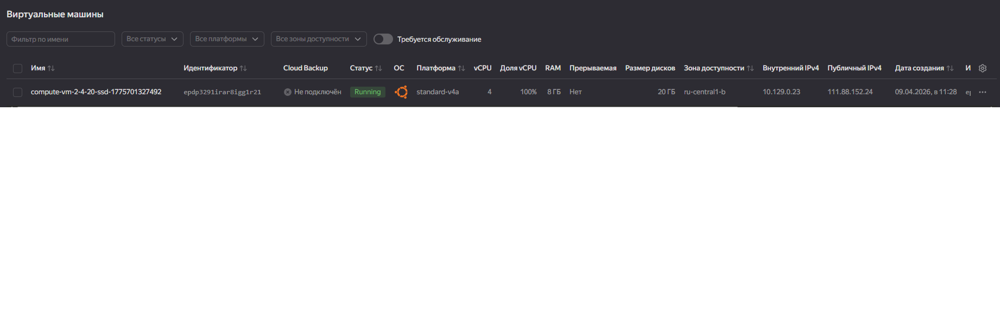

---

## 🗄️ 2. База данных

Создана БД `taxi_analytics` с таблицами:

- `users` — пассажиры
- `drivers` — водители
- `orders` — заказы
- `rides` — поездки

[SQL-скрипт на создание таблиц](sql/01_create_tables.sql)

Написал SQL-скрипт в pgAdmin 4
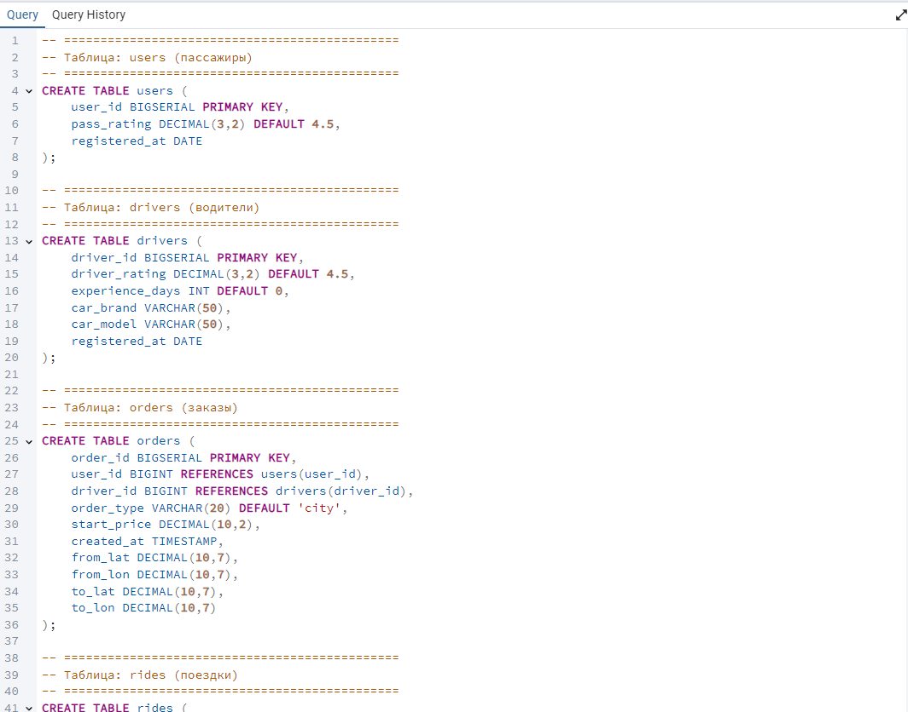
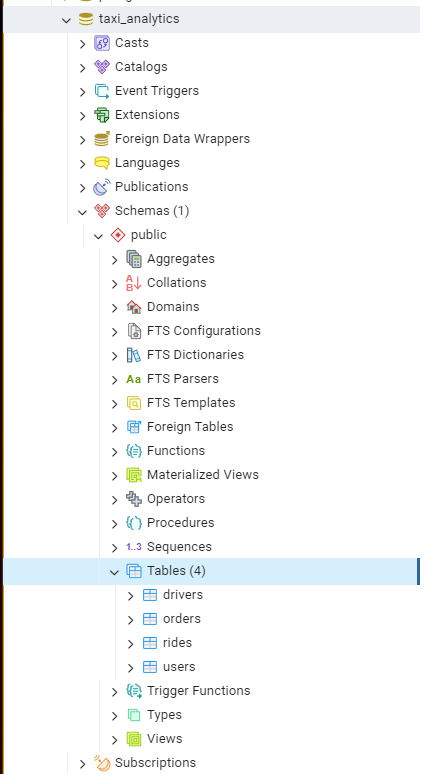

---

## 🐍 3. Генерация данных

Написан Python-скрипт для заполнения БД:

- 5000 пассажиров
- 1000 водителей
- ~230 000 заказов
- ~200 000 поездок

[Python-скрипт на геренацию данных](scripts/generate_data.py)

Написал скрипт для генерации искусственных данных в БД
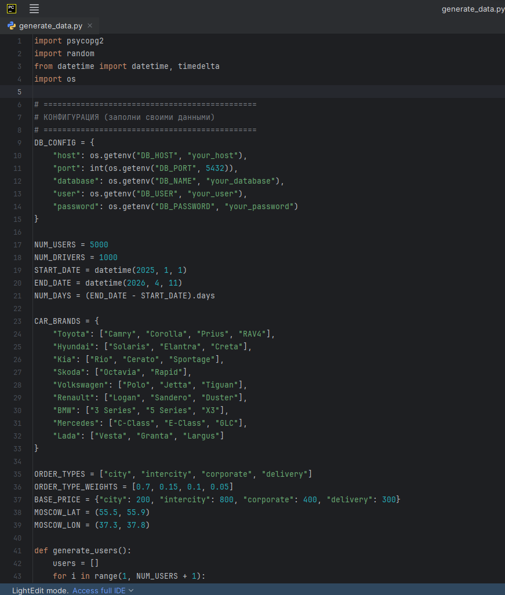

Заполненные таблицы (пример - таблица drivers)
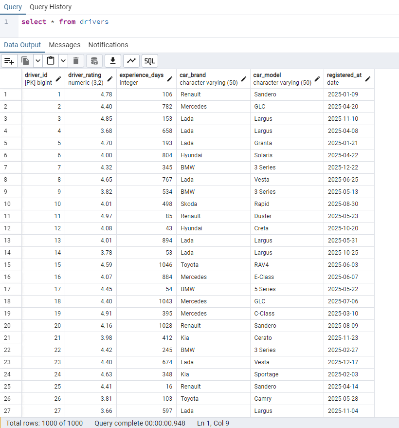

---

## ⏰ 4. Автоматизация (Airflow)

Создан DAG `taxi_daily_etl`.  
Запуск каждый день в 00:00 UTC, добавляет 30–80 заказов и поездок за текущую дату, а также настроил логи.

[Python-код DAG для Airflow](airflow/taxi_daily_etl.py)

Написал Python-код DAG
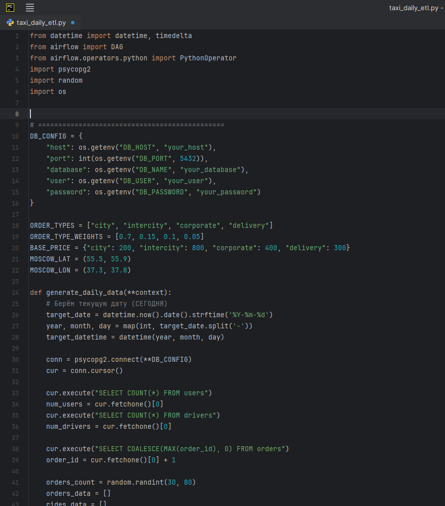

Настроил и запустил DAG в Airflow
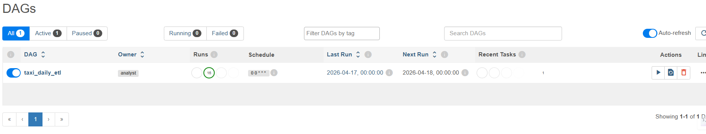
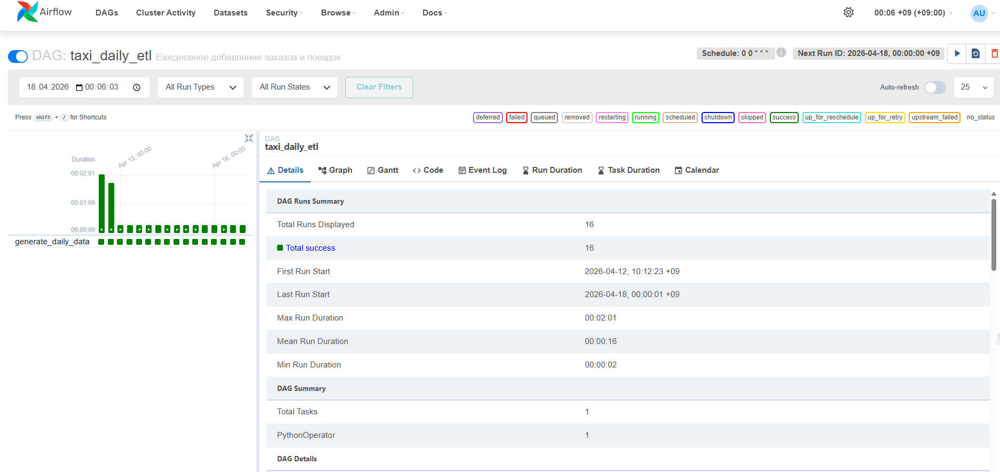

Настроил логи
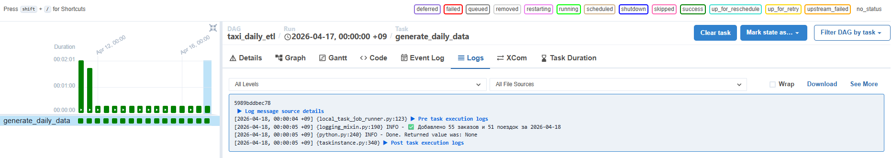

---

## 📊 5. Дашборды Redash

Были созданы три дэшборда и скрипты метрик для графиков:
- Оперативные метрики (LIVE) - [ссылка на дашборд Redash](http://111.88.152.24:5000/public/dashboards/fZmtN396KI95CbRyC8msIT64ex6W6Ud8usZidfq4?org_slug=default)
- Итоги за 2025 год - [ссылка на дашборд Redash](http://111.88.152.24:5000/public/dashboards/HsgoXH9JfHlDbswKMD5ijDivv2QljyonyrEJfKtU?org_slug=default)
- Итоги за 2026 год - [ссылка на дашборд Redash](http://111.88.152.24:5000/public/dashboards/S1bI7l9yctpyHJ2KxYk2LoB4rNTXkADvyOpqqWQH?org_slug=default)

- [SQL-скрипты для графиков](sql/02_dashboard_queries.sql)

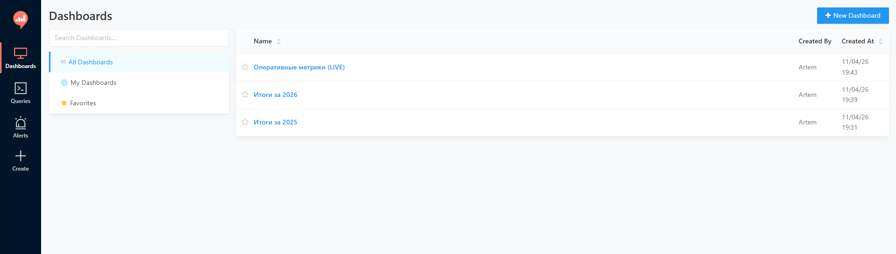

### 5.1 Оперативные метрики (LIVE)
Сравнение сегодня vs вчера (выручка, поездки, средний чек, конверсия).

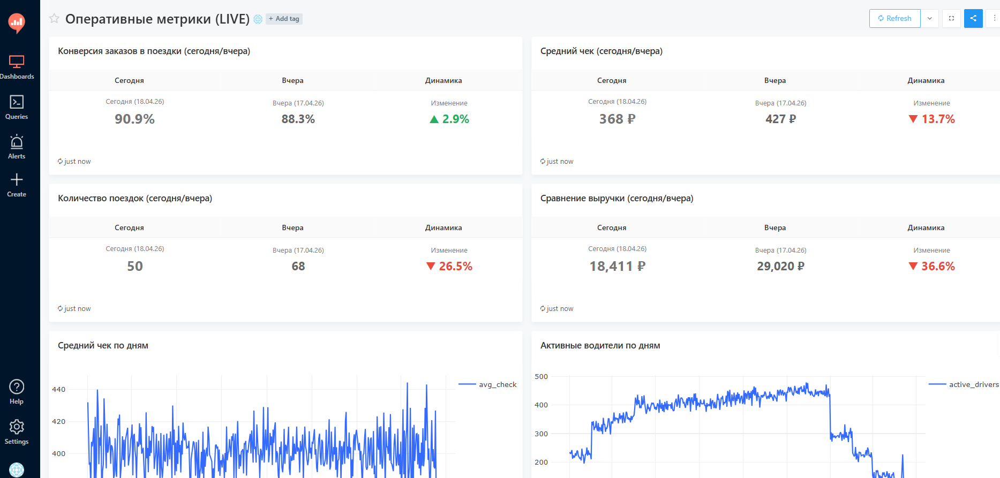
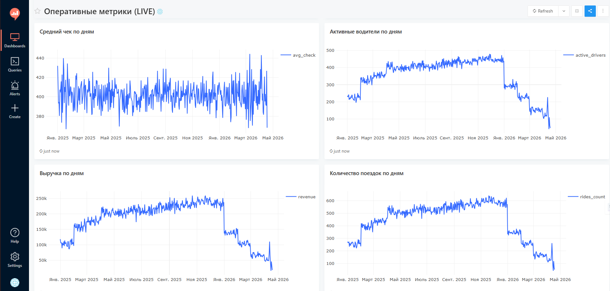
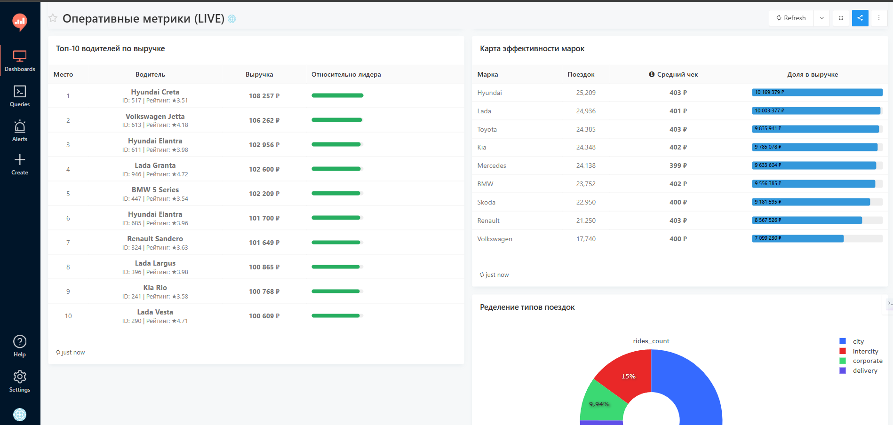
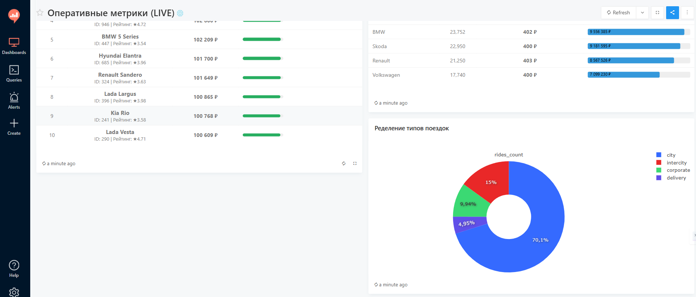

### 5.2 Итоги за 2025
Выручка, заказы, поездки, AOV, DAU, WAU, MAU, LTV, топ водителей, типы поездок, аналитика по маркам.

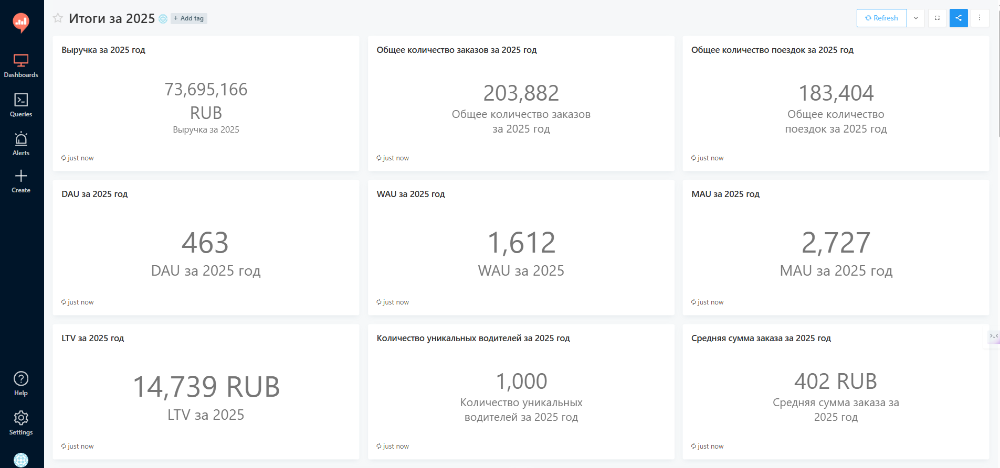
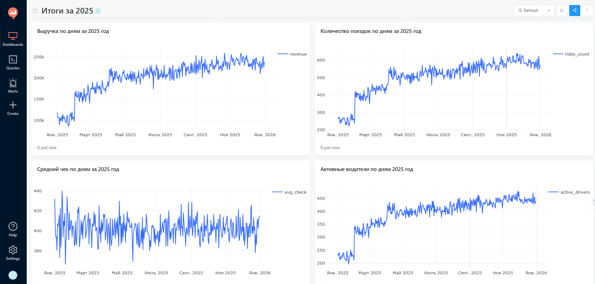
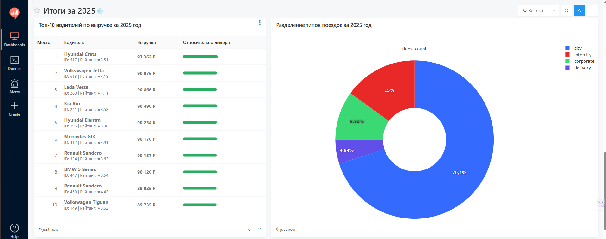
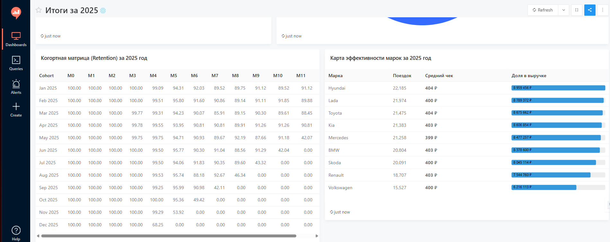

### 5.3 Итоги за 2026
Аналогичные метрики за январь–н.в. 2026.

---

## 🔬 6. Проверка гипотез

Jupyter Notebook, подключение к PostgreSQL через `create_engine`.  
Проверены 5 гипотез (t-test):

| № | Гипотеза | Результат |
|---|----------|-----------|
| 1 | Рейтинг >4.8 → выше выручка | ❌ |
| 2 | В выходные чек выше | ❌ |
| 3 | Конверсия city > intercity | ❌ |
| 4 | Опытные водители зарабатывают больше | ❌ |
| 5 | Вечерний чек > утреннего | ❌ |

[Ноутбук](notebooks/Taxi.ipynb)

---

## ✅ Итоги

- Развёрнута облачная инфраструктура
- Созданы 3 дашборда (14+ визуализаций)
- Настроена автоматизация через Airflow
- Проверены 5 статистических гипотез

---

## 📬 Контакты

- Telegram: @closedforprayer
- Email: fluery1111@mail.ru